# Instagram Accounts Genuinity Classification

The advancement of technology in these past decades has brought forth the growth of many different social media platforms. Although social media are efficient platforms where people can obtain and share information quickly, this is also a place where that information could be jeopardized and manipulated via fraudulent activities. The goal of this study is to utilize the collected features of multiple Instagram accounts, build models that can predict whether an account is genuine or fake by applying various classification methodologies and in a way help combating fraudulent activities on the internet.

**Zero/Near Zero variance predictors**

Data sets sometimes come with predictors that consist of a single unique value across all samples (Zero-Variance). This kind of predictors is not only non-informative, they may also cause some models to crash or the fit to be unstable. Similarly, there are predictors that have the number of unique values occurring with very low frequency (Near Zero-Variance). Such predictors are very common among data; and the data set used for this project is not an exception. These predictors may be excluded from the data set before the model training process.
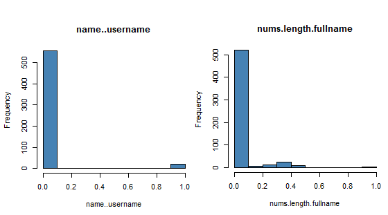

**Multi-collinearity**

Multi-collinearity occurs when predictors are intercorrelated instead of being independent. In other words, it refers to predictors that are correlated with other predictors in a model. Moderate multicollinearity might not be problematic; however, strong multicollinearity is a serious problem that needs to be taken care of.
Multicollinearity induces variance inflation when predictors are strongly intercorrelated. This results in wider Confidence Intervals for the true parameter estimates and makes models less reliable. Thus, detection of Multicollinearity is crucial to training models. A method called Variance Inflation Factor (VIF) can be used. As the name suggests; VIF measures how much the variance of estimated coefficients is inflated as compared to when the predictor variables are not related. There is no limit on the magnitude of VIF. As a rule of thumb, VIF greater than 5 is considered as highly correlated predictors.
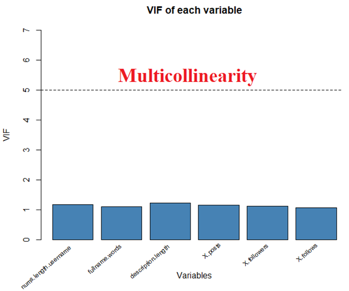

**Transformation**

One of the most common assumptions when doing statistical analysis is normality. Predictors often do not meet the assumptions of parametric statistical test (such as ANOVA) because they are not normally distributed. Therefore, using these statistical tests on such predictors might give incorrect or misleading results. In practice, transforming skewed or non-normal distributed predictors will make models fit statistical assumptions better.
Depending on whether a predictor is skewed left or right; appropriate transformation can be used to eliminate skewness. For instance, some popular transformations are log transformation, square root, inverse, Box-Cox, Yeo-Johnson, etc. For this project, Box-Cox transformation is used in order to transform data into normality. Not all the continuous variables will become normally distributed after the transformation due to some of them having extreme skewness or outliers; however, they will be less skewed at the least.

**Standardization**

Predictors may have different units (for example: scores, feet, dollars, hours); which in turn means that they have different scales. Specifically in this data set, X.followers (number of followers) and fullname.word (full name in words token) are most likely to have different scales.
Differences in scales across predictors may be problematic when training models. Large scale predictors can result in a model that learns large parameter estimates; which make those predictors seem more important and more predictive than the small-scale predictors; even when they have the same predictive power. Below is a comparison of before and after standardization of the continuous variable. The top three plots include the distributions of the predictors after Box-Cox transformations without being standardized yet.
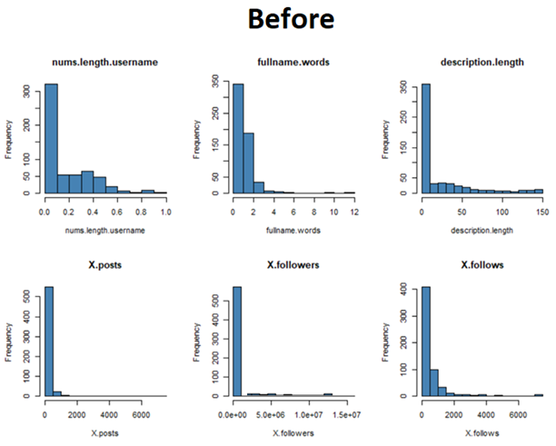
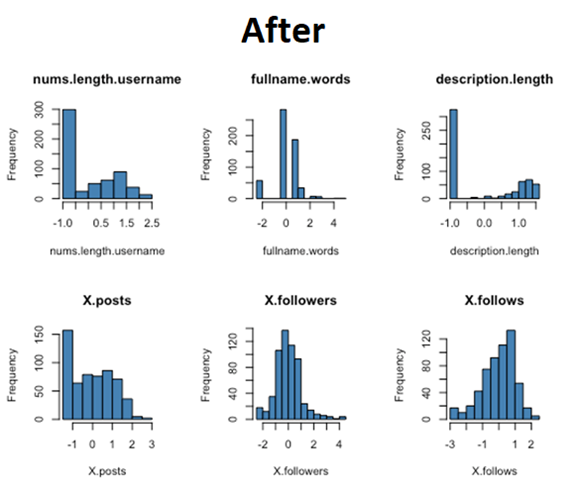

**Spatial Sign**

In general, outliers are observations that are exceptionally far from the majority of the data. Outliers are defined differently depending on the context and business problems. Even with a thorough understanding of the data set, outliers can still be hard to define. Outliers can be excluded from the dataset before model training process. However, removing outliers would not be beneficial if the dataset is small such as this dataset because the amount of data would be insufficient for the models to learn. One data transformation that can minimize the problem is Spatial Sign. This transformation projects the data for a predictor to the unit circle in p-dimensions, where p is the number of predictors. In simple terms, this transformation brings the outliers towards the majority of the data.
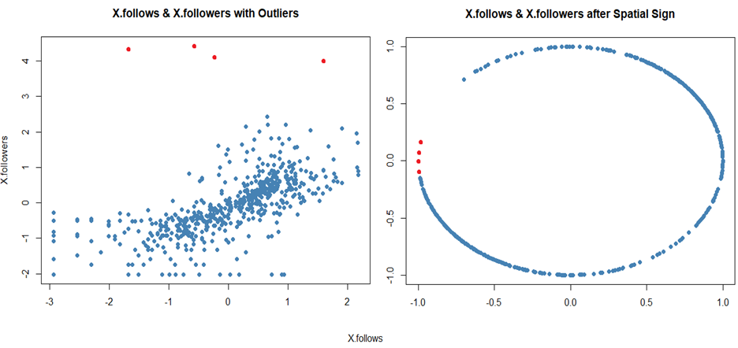

**Performances of models used in this project are described below:**
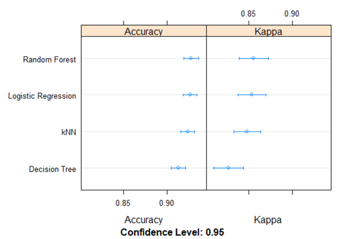
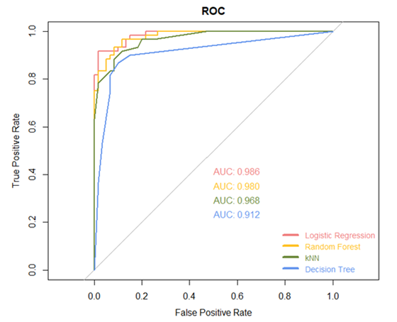

**Visualization of the decision boundaries made by each model on a 2-d space (using only 2 features):**

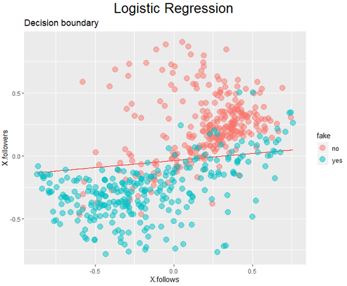
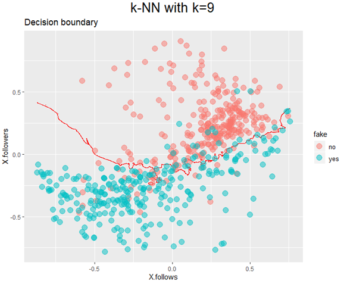
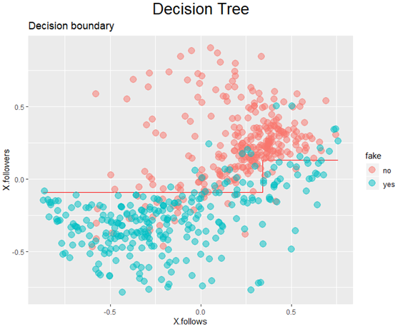
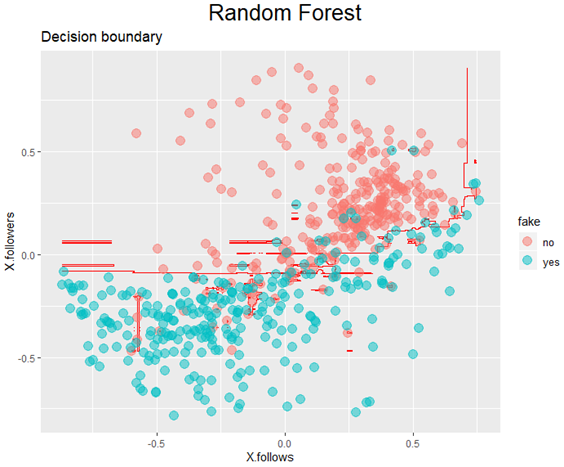
